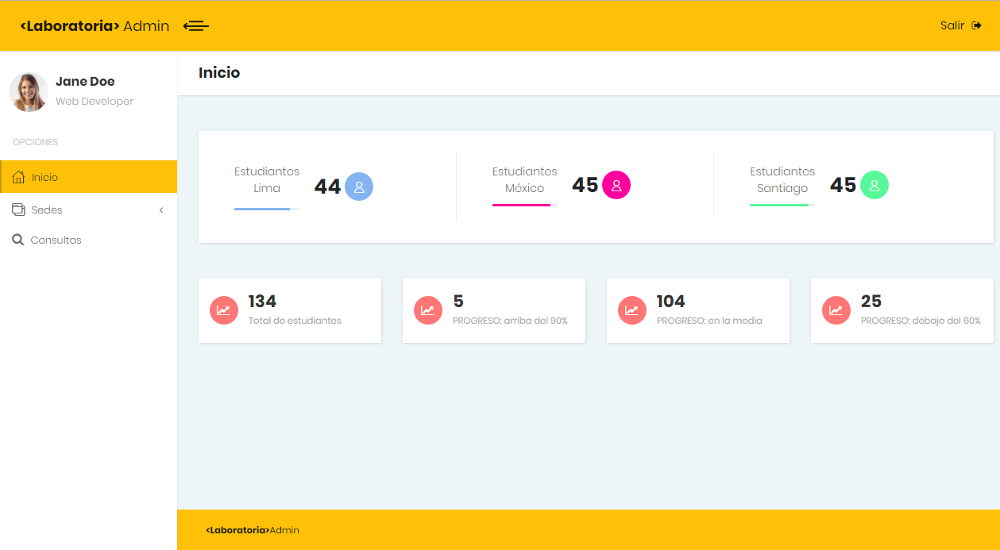
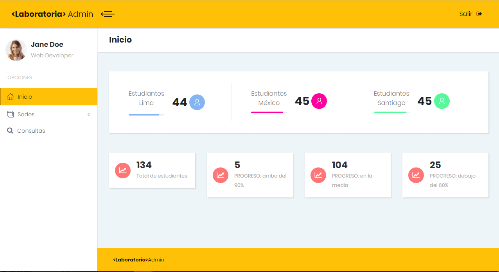
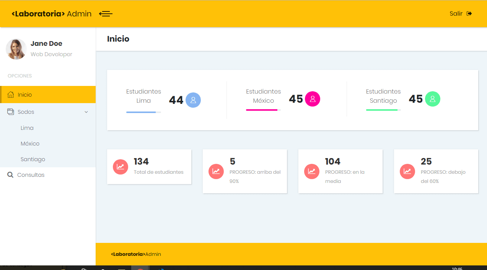
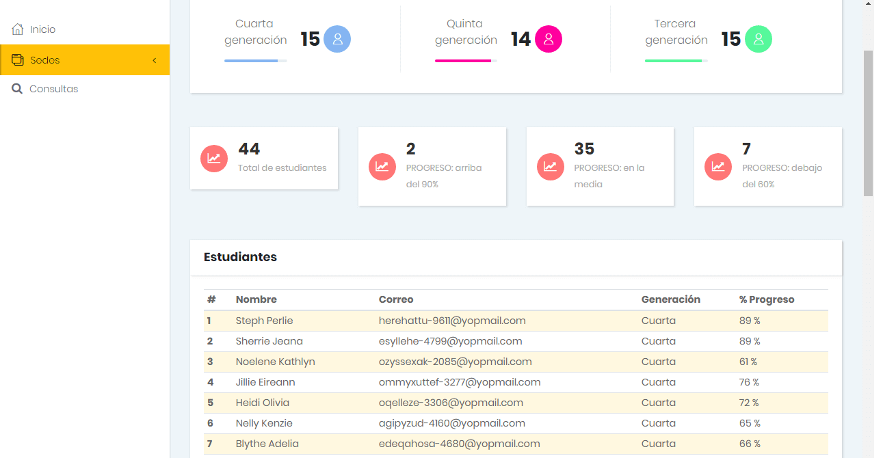

## DATA DASHBOARD 

> Este  Data dashboard esta desarrollado para ser utilizado por el staff de Laboratoria. Permite manejar de forma eficaz toda la información referente al control de las estudiantes, a través de una interfaz intuitiva y fácil de usar.
La implementación de este sistema automatizará la administración, el acceso y la visualización de la información.

#### Características
El data dashboard `<Laboratoria> Admin` permite a sus usuarios:
1. Visualizar estadísticas generales de todas las sedes (total de estudiantes, número de estudiantes según clasificación de progreso: `Alto`, `Medio` y `Suficiente`).
2. Listar y seleccionar sedes.
3. Dentro de cada sede:
	- Visualizar estadísticas generales (total de estudiantes, número de estudiantes según clasificación de progreso: `Alto`, `Medio` y `Suficiente`).
	- Listar y seleccionar generaciones.
	- Listar estudiantes con información básica y porcentaje de completitud.
	- Ordenar estudiantes de forma ascendente y descendente por nombre o porcentaje de completitud.
4. Dentro de cada generación:
	- Visualizar estadísticas generales (total de estudiantes, número de estudiantes según clasificación de progreso: `Alto`, `Medio` y `Suficiente`).
	- Listar estudiantes con información básica y porcentaje de completitud.
	- Ordenar estudiantes de forma ascendente y descendente por nombre o porcentaje de completitud.
5. Para cada estudiante:
	- Visualizar porcentaje de avance por tema.
	- Visualizar información personal (nombre, correo, sede, generación, turno).
	- Visualizar porcentaje de completitud general y clasificación de progreso.
6. Realizar consultas por nombre de estudiante.

#### Tecnologías
Para desarrollo de este proyecto se utilizaron las siguientes tecnologías:
1. HTML5
2. CSS3
3. JavaScript (ES6)
4. Bootstrap

### Instalación
Para realizar contribuciones a este proyecto se requiere hacer _fork_ o _clonar_ el repositorio, instalar `Node.js` y las dependencias del proyecto con el comando `npm install`.

#### Pantallas del proyecto

#### Desarrolladoras
[Brenda Sànchez](https://github.com/sanrey254) y [Jazmìn Reyes](https://github.com/jaztan)

 
 

